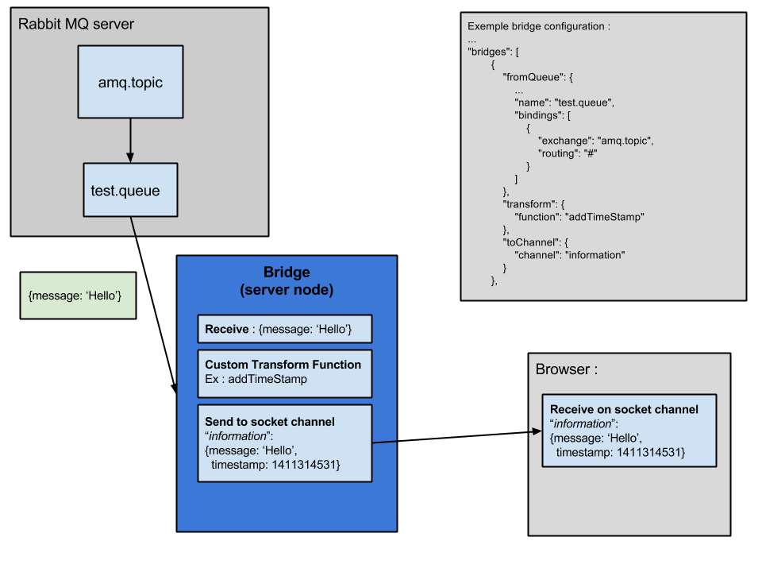
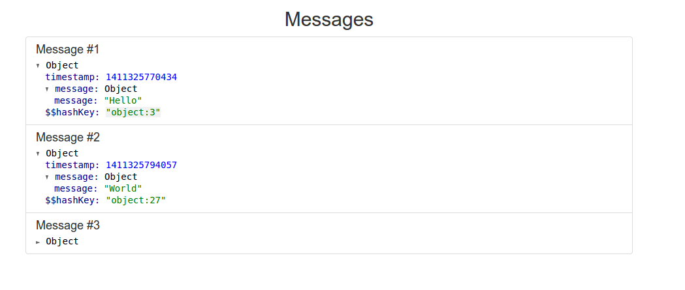

#AMQP to Socket Bridge

This project is a simple bridge implementation to link messages from an AMQP server to socket channels.

I first created this project to implement my own logger/debugger. Using SOA architecture I was looking to find an easy way to centralize my logs in order to debug easily and know what happened exactly.

This implementation is flexible enough in its configuration to allow you to send messages to queues and receive the data as socket messages in your browser.
Almost everything is configurable from the configuration file. In this file you can define :

 * your RabbitMQ server
 * your different queues that you want to listen to
 * their bindings to exchanges
 * a custom function to transform the message from the queue before it is passed on to the socket channel
 * a socket channel

## How it works

Here is a simple example on how the bridge works :



## How to test it ?

####Requirements:
 * a running RabbitMQ server
    * [installation page](https://www.rabbitmq.com/download.html)

You can now play around with the project by modifying the configuration file in `config/default.json`.
 * add a bridge
 * reference a custom "transformation" function by creating one in the file `lib/Transformer.js`
 * ...

 ```bash
 $ node app.js
 ```

 Finally open the file `examples/index.html` in your browser and start sending JSON messages to the exchange you have configured in `config/default.json`. You should be able
 to see your live logs.

 Ex :
 
